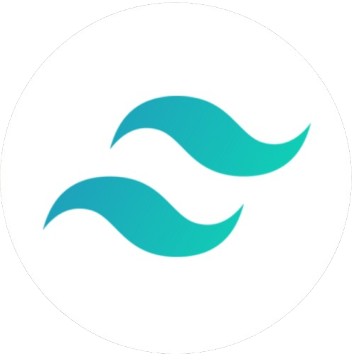
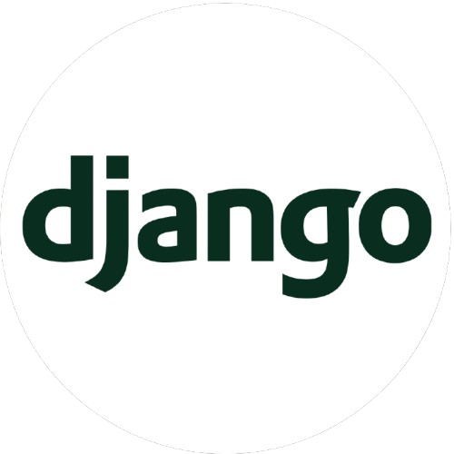
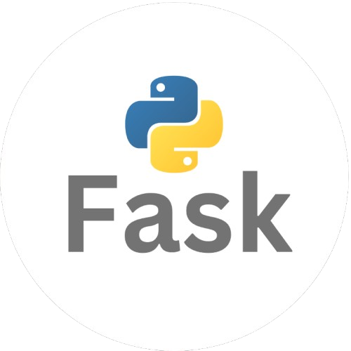

# Hi there! 👋 I'm **Wamiq Zahid**  
### A Self-taught Software Engineer specializing in building scalable web applications, backend systems, deployment, and delivering value-driven digital solutions with clean code and robust architecture.
---

 

## 🚀 **Core Languages**

    

  
  

## 🚀 **Development**

    

   
   
   
   
   
   
   
   
   
 

## 🚀 **Deployment**

 
 

## 🚀 Future Goals for 2025

- **Backend & Deployment 🌐**: Enhance skills in **Kubernetes**, **CLI**, **PostgreSQL**, and **TypeScript** for backend development.
- **Mobile Development 📱**: Learn **React Native** to build cross-platform mobile apps.
- **Web Security 🕵️‍♂️**: Explore **ethical hacking** and web security.
- **Linux Mastery 🐧**: Transition to **linux Parrot OS** for development and security testing.
- 
## 🚀 Connect With Me

  
  

